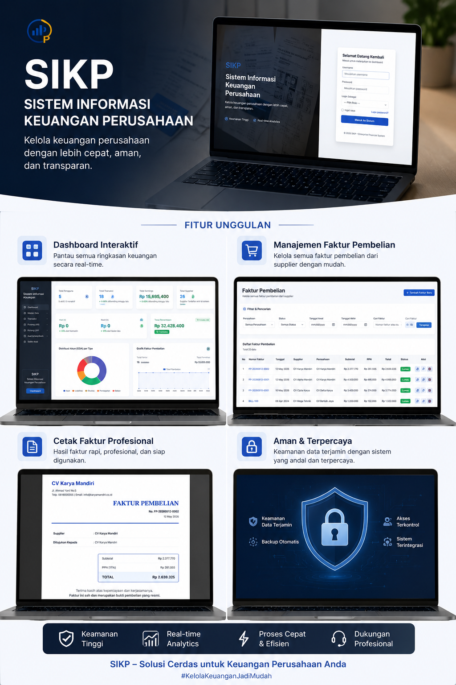
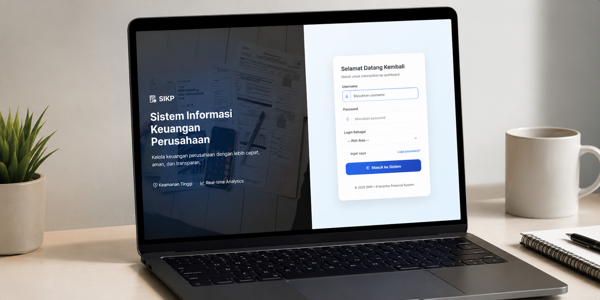
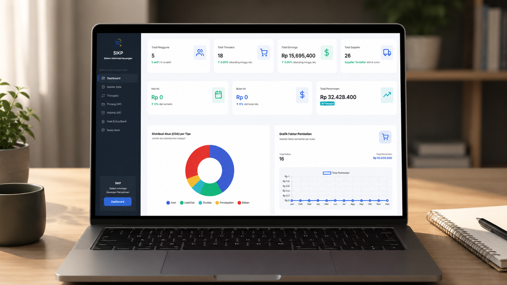
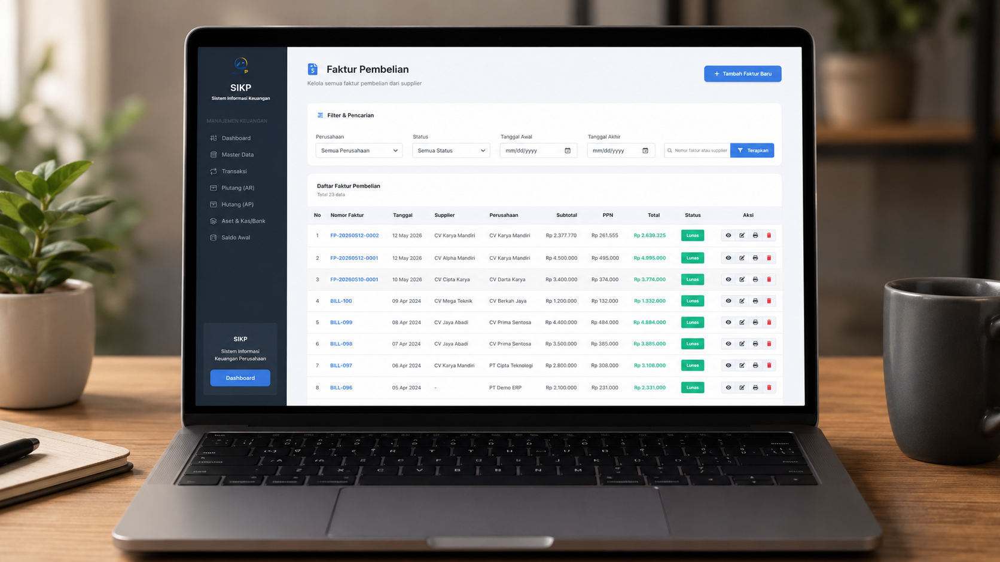
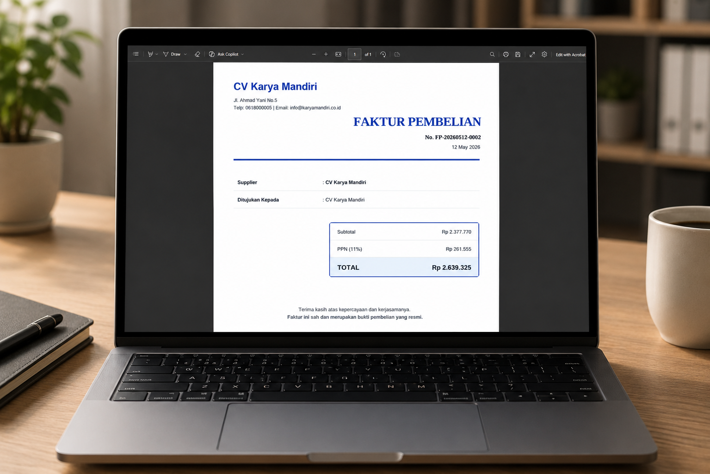

  

<h1 align="center">💼 Sistem Informasi Keuangan Perusahaan (SIKP)</h1>

  Solusi digital modern untuk pengelolaan keuangan perusahaan yang lebih
  <b>efisien, akurat, aman, dan transparan</b>.

  
  
  
  
  

---

## ✨ Tentang Project

**SIKP (Sistem Informasi Keuangan Perusahaan)** adalah aplikasi berbasis web yang dirancang untuk membantu perusahaan dalam mengelola aktivitas keuangan secara terintegrasi dan real-time.

Sistem ini menyediakan fitur pencatatan transaksi, pengelolaan laporan keuangan, monitoring arus kas, hingga manajemen pengguna dalam satu platform yang modern dan mudah digunakan.

Dengan pendekatan digitalisasi, SIKP membantu perusahaan meningkatkan efisiensi operasional, mengurangi kesalahan pencatatan, dan mendukung pengambilan keputusan berbasis data.

---

# 📸 Tampilan Sistem

## 🧩 System Flow Diagram

  

---

## 📊 Dashboard Utama

  

  

  

  

  

---

## 💰 Manajemen Keuangan

  

---

# 🎯 Tujuan Sistem

- Mempermudah pengelolaan transaksi keuangan perusahaan
- Meningkatkan efisiensi proses administrasi
- Menyediakan laporan keuangan otomatis dan akurat
- Meminimalisir human error pada pencatatan manual
- Mendukung monitoring kondisi keuangan secara real-time

---

# ⚡ Fitur Utama

## 💰 Manajemen Keuangan

- Pencatatan pemasukan & pengeluaran
- Monitoring arus kas perusahaan
- Riwayat transaksi terintegrasi

## 📊 Laporan Keuangan

- Laporan harian, bulanan, dan tahunan
- Rekap data otomatis
- Informasi keuangan real-time

## 👤 User Management

- Multi user & role management
- Hak akses berdasarkan level pengguna
- Sistem autentikasi aman

## 🔐 Security System

- Authentication & Authorization
- CSRF Protection
- Input Validation
- Session Security

## 📁 Data Management

- Penyimpanan data terstruktur
- Database relational yang optimal
- Data integrity & consistency

---

# 🧠 Keunggulan Sistem

✅ Interface modern dan user-friendly  
✅ Struktur aplikasi scalable dan maintainable  
✅ Berbasis web sehingga fleksibel diakses  
✅ Menggunakan arsitektur Laravel MVC  
✅ Mudah dikembangkan untuk kebutuhan perusahaan  
✅ Mendukung digitalisasi proses bisnis perusahaan

---

# 🛠️ Tech Stack

<table>
<tr>
<td valign="top" width="33%">

### Backend

- Laravel
- PHP 8+
- RESTful API
- MVC Architecture

</td>

<td valign="top" width="33%">

### Frontend

- Blade Template Engine
- HTML5
- CSS3
- JavaScript (ES6+)
- Bootstrap / Tailwind CSS

</td>

<td valign="top" width="33%">

### Database & Tools

- MySQL
- Composer
- Git & GitHub
- Laravel Artisan
- Postman

</td>
</tr>
</table>
